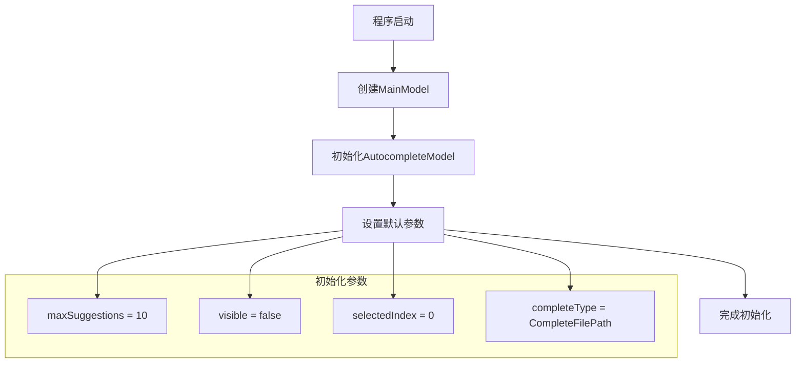
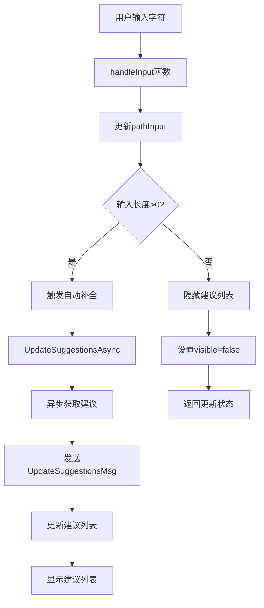
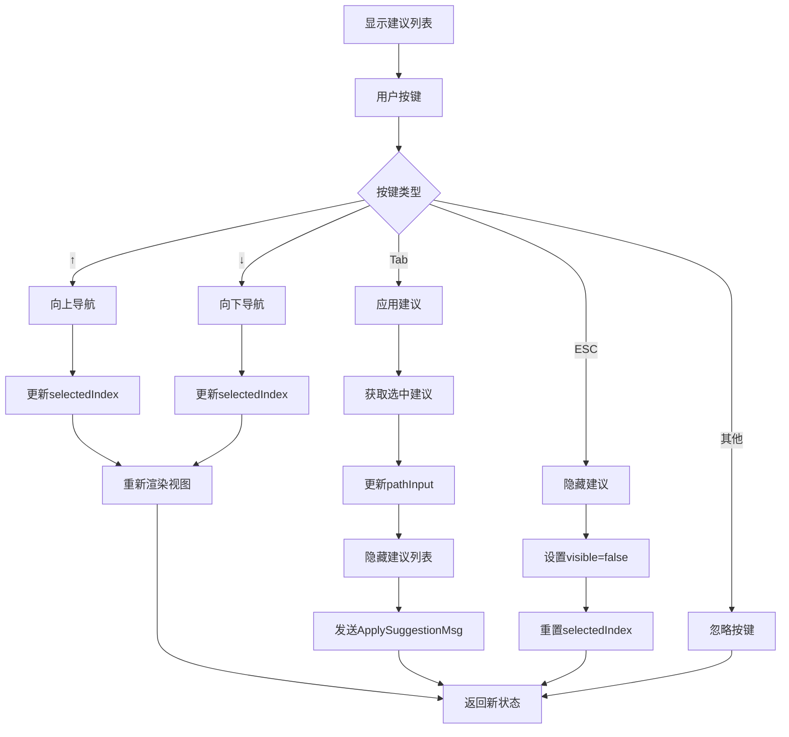
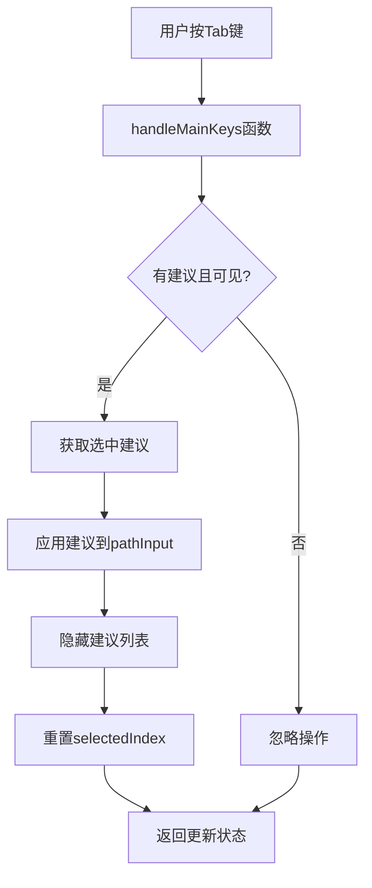

# 自动补全工作流文档

## 概述

本文档详细描述了TUI界面中自动补全功能的工作流程、交互逻辑和实现细节。自动补全模块旨在提升用户在路径输入时的效率和准确性。

## 功能架构

### 核心组件

```
AutocompleteModel (cmd/tui/models/autocomplete.go)
├── 建议管理器
│   ├── suggestions []string      # 建议列表
│   ├── selectedIndex int        # 当前选中项
│   └── maxSuggestions int       # 最大建议数
├── 输入处理器
│   ├── input string             # 当前输入
│   ├── visible bool            # 是否显示建议
│   └── completeType types.CompleteType # 补全类型
├── 渲染引擎
│   ├── width, height int       # 视图尺寸
│   └── lipgloss.Style        # 样式配置
└── 异步更新器
    ├── UpdateSuggestionsAsync() # 异步获取建议
    └── ApplySuggestion()       # 应用选中建议
```

### 集成关系

```
MainModel (cmd/tui/main.go)
├── autocomplete *AutocompleteModel    # 自动补全模型
├── showAutocomplete bool              # 显示状态
└── pathInput string                   # 输入字段

消息系统 (cmd/tui/models/messages.go)
├── UpdateSuggestionsMsg                 # 更新建议消息
└── ApplySuggestionMsg                   # 应用建议消息
```

## 工作流程

### 1. 初始化流程



### 2. 用户输入触发流程



### 3. 建议显示和导航流程



### 4. 建议应用流程



## 关键函数实现

### 1. 异步建议更新

```go
func (m *AutocompleteModel) UpdateSuggestionsAsync(input string, completeType types.CompleteType) tea.Cmd {
    return func() tea.Msg {
        suggestions, err := m.autocompleter.Complete(input, completeType)
        if err != nil {
            return UpdateSuggestionsMsg{
                Suggestions: []string{},
                Error:       err,
            }
        }
        
        return UpdateSuggestionsMsg{
            Suggestions: suggestions,
            Error:       nil,
        }
    }
}
```

### 2. 建议应用逻辑

```go
func (m *AutocompleteModel) ApplySuggestion() (string, bool) {
    if !m.visible || len(m.suggestions) == 0 {
        return "", false
    }
    
    selectedIndex := m.selectedIndex
    if selectedIndex < 0 || selectedIndex >= len(m.suggestions) {
        return "", false
    }
    
    suggestion := m.suggestions[selectedIndex]
    m.visible = false
    m.selectedIndex = 0
    
    return suggestion, true
}
```

### 3. 视图渲染

```go
func (m *AutocompleteModel) View() string {
    if !m.visible || len(m.suggestions) == 0 {
        return ""
    }
    
    var items []string
    for i, suggestion := range m.suggestions {
        item := m.renderSuggestion(suggestion, i == m.selectedIndex)
        items = append(items, item)
    }
    
    content := strings.Join(items, "\n")
    return m.containerStyle.Width(m.width).Render(content)
}
```

## 用户交互设计

### 键盘快捷键

| 按键 | 功能 | 适用场景 |
|------|------|----------|
| Tab | 应用选中建议 | 建议列表显示时 |
| ↑ | 向上选择建议 | 建议列表显示时 |
| ↓ | 向下选择建议 | 建议列表显示时 |
| ESC | 隐藏建议列表 | 建议列表显示时 |
| 其他字符 | 继续输入 | 任何时间 |

### 视觉反馈

1. **建议列表样式**
   - 背景色: `lipgloss.Color("240")`
   - 边框色: `lipgloss.Color("241")`
   - 选中项: 高亮显示 + 粗体

2. **状态指示**
   - 显示建议数: `显示 3/10 个建议`
   - 加载状态: 异步获取时显示加载提示
   - 错误处理: 静默处理，用户无感知

### 操作提示

主界面显示的操作提示包含自动补全相关快捷键：
```
操作:
  Enter - 开始扫描
  s - 选择文件
  c - 配置设置
  Tab - 应用自动补全建议
  ↑↓ - 选择自动补全建议
  ESC - 退出程序
  Ctrl+C - 强制退出
```

## 错误处理机制

### 异常情况处理

1. **建议获取失败**
   ```go
   if err != nil {
       // 静默处理，返回空建议列表
       return UpdateSuggestionsMsg{
           Suggestions: []string{},
           Error:       nil, // 不暴露错误给用户
       }
   }
   ```

2. **索引越界保护**
   ```go
   if selectedIndex < 0 {
       selectedIndex = 0
   }
   if selectedIndex >= len(suggestions) {
       selectedIndex = len(suggestions) - 1
   }
   ```

3. **空输入处理**
   ```go
   if len(input) == 0 {
       m.visible = false
       m.suggestions = []string{}
       return m
   }
   ```

### 容错策略

- **静默失败**: 自动补全失败不影响主功能
- **状态重置**: 异常情况自动重置到安全状态
- **用户无感知**: 错误处理不中断用户操作流程

## 性能优化

### 异步处理

```go
// 避免阻塞UI线程
go func() {
    suggestions := getSuggestions(input)
    // 通过消息机制更新UI
    sendMessage(UpdateSuggestionsMsg{
        Suggestions: suggestions,
    })
}()
```

### 缓存机制

```go
// 利用现有的自动补全缓存
if cached, found := cache.Get(input); found {
    return cached.([]string)
}
```

### 限流控制

```go
// 限制最大建议数
const maxSuggestions = 10
if len(suggestions) > maxSuggestions {
    suggestions = suggestions[:maxSuggestions]
}
```

## 测试策略

### 单元测试

1. **模型测试**
   - 建议更新逻辑
   - 导航功能测试
   - 应用建议测试
   - 错误处理测试

2. **集成测试**
   - 与MainModel集成
   - 消息传递测试
   - 键盘事件处理
   - 视图渲染测试

### 用户场景测试

1. **基本输入场景**
   ```
   输入: "/usr/"
   期望: 显示以"/usr/"开头的路径建议
   ```

2. **导航场景**
   ```
   操作: 输入路径 → 显示建议 → 按↓键 → 按Tab键
   期望: 应用选中的建议到输入框
   ```

3. **边界场景**
   ```
   输入: 空字符串
   期望: 不显示建议列表
   ```

## 已知问题

### 当前状态
- ✅ 基本功能实现完成
- ✅ 键盘交互正常工作
- ✅ 异步更新机制完善
- ✅ 错误处理机制健全

### 待优化项
1. **配置集成**: 需要添加自动补全相关配置选项
2. **历史记录**: 可以实现常用路径记忆功能
3. **性能监控**: 建议添加性能指标收集
4. **多语言支持**: 支持多语言路径名

## 维护指南

### 代码修改注意事项

1. **保持向后兼容**: 修改消息类型时确保兼容性
2. **测试覆盖**: 新增功能必须添加对应测试
3. **文档同步**: 代码变更时更新工作流文档
4. **性能考虑**: 避免在主线程执行耗时操作

### 调试技巧

1. **日志调试**: 使用`log.Printf`输出关键状态
2. **消息追踪**: 监控消息传递流程
3. **状态检查**: 验证模型状态一致性
4. **性能分析**: 使用pprof分析性能瓶颈

## 相关资源

- [AutocompleteModel 源码](../cmd/tui/models/autocomplete.go)
- [MainModel 集成代码](../cmd/tui/main.go)
- [消息定义](../cmd/tui/models/messages.go)
- [实施报告](tui-autocomplete-implementation-report.md)
- [集成方案](tui-autocomplete-integration.md)

## 更新日志

### v1.0.0 (当前版本)
- 创建完整的自动补全工作流文档
- 详细描述功能架构和实现细节
- 提供完整的测试策略指南
- 记录已知问题和优化建议