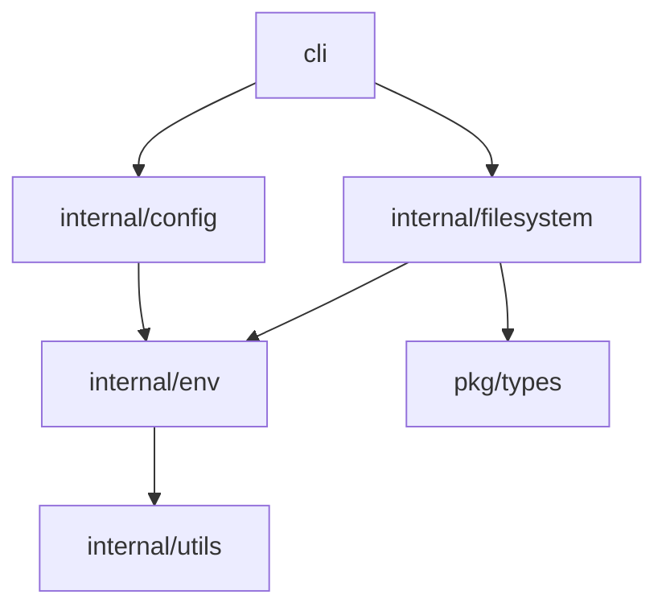
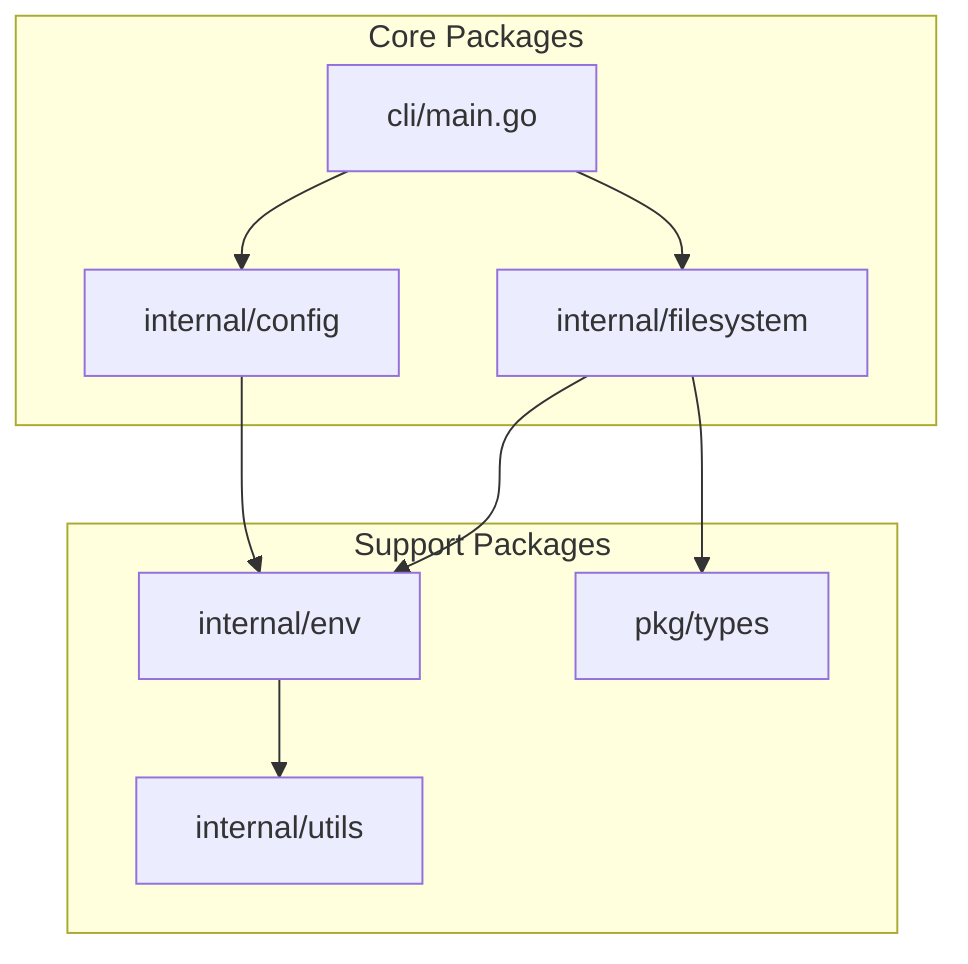

# 架构分析功能扩展计划

## 功能概述

基于repomix的架构分析功能，为项目添加代码架构可视化、依赖关系分析和架构质量评估能力，帮助开发者理解代码结构和改进架构设计。

## 当前状态分析

### 现有功能
- ❌ 无架构分析功能
- ❌ 无法可视化代码结构
- ❌ 缺少依赖关系分析

### 与repomix对比
- ❌ 缺少架构可视化
- ❌ 缺少依赖分析
- ❌ 缺少质量评估

## 扩展目标

### 核心功能
1. **代码结构分析** - 包、模块、类层次结构
2. **依赖关系可视化** - 导入/导出关系图
3. **架构质量评估** - 耦合度、内聚性指标
4. **架构建议生成** - 改进建议和重构指导

### 分析维度
- **静态分析** - 代码结构解析
- **动态分析** - 运行时依赖关系
- **质量分析** - 架构指标计算
- **可视化分析** - 图形化展示

## 技术实现方案

### 1. 架构分析引擎

#### 核心架构
```go
type ArchitectureAnalyzer struct {
    parsers      map[string]CodeParser
    analyzers    []ArchitectureAnalyzer
    visualizers  []ArchitectureVisualizer
    config       AnalysisConfig
}

type CodeParser interface {
    Parse(filePath string, content string) (*CodeStructure, error)
    GetSupportedLanguages() []string
}

type ArchitectureAnalyzer interface {
    Analyze(structure *ProjectStructure) *AnalysisResult
    GetName() string
}
```

#### 分析器类型
- **结构分析器** - 包/模块/类层次
- **依赖分析器** - 导入/导出关系
- **质量分析器** - 架构指标计算
- **模式检测器** - 架构模式识别

### 2. 代码结构解析

#### 项目结构表示
```go
type ProjectStructure struct {
    Name         string                 `json:"name"`
    RootPath     string                 `json:"root_path"`
    Languages    map[string]LanguageInfo `json:"languages"`
    
    Packages     []PackageInfo          `json:"packages"`
    Modules      []ModuleInfo           `json:"modules"`
    Files        []FileInfo             `json:"files"`
    
    Dependencies []DependencyInfo       `json:"dependencies"`
    Metrics      ArchitectureMetrics    `json:"metrics"`
}

type PackageInfo struct {
    Name        string       `json:"name"`
    Path        string       `json:"path"`
    Files       []FileInfo   `json:"files"`
    Dependencies []string    `json:"dependencies"`
    Metrics     PackageMetrics `json:"metrics"`
}

type DependencyInfo struct {
    Source      string       `json:"source"`
    Target      string       `json:"target"`
    Type        DependencyType `json:"type"`
    Strength    int          `json:"strength"`
    Description string       `json:"description"`
}
```

### 3. 架构质量指标

#### 质量指标体系
```go
type ArchitectureMetrics struct {
    // 耦合度指标
    Coupling struct {
        AfferentCoupling  int     `json:"afferent_coupling"`    // 传入耦合
        EfferentCoupling  int     `json:"efferent_coupling"`    // 传出耦合
        Instability      float64 `json:"instability"`          // 不稳定性
        Abstractness     float64 `json:"abstractness"`         // 抽象度
    } `json:"coupling"`
    
    // 内聚性指标
    Cohesion struct {
        LackOfCohesion   float64 `json:"lack_of_cohesion"`     // 缺乏内聚
        ModuleCohesion   float64 `json:"module_cohesion"`      // 模块内聚
        FunctionalCohesion float64 `json:"functional_cohesion"` # 功能内聚
    } `json:"cohesion"`
    
    // 复杂度指标
    Complexity struct {
        Cyclomatic       float64 `json:"cyclomatic"`           # 圈复杂度
        Cognitive        float64 `json:"cognitive"`             # 认知复杂度
        Structural       float64 `json:"structural"`           # 结构复杂度
    } `json:"complexity"`
    
    // 规模指标
    Size struct {
        LinesOfCode      int     `json:"lines_of_code"`        # 代码行数
        FilesCount       int     `json:"files_count"`          # 文件数量
        PackagesCount    int     `json:"packages_count"`       # 包数量
        FunctionsCount   int     `json:"functions_count"`       # 函数数量
    } `json:"size"`
}
```

### 4. 可视化系统

#### 图形化输出
```go
type ArchitectureVisualizer interface {
    Visualize(structure *ProjectStructure, config VisualizationConfig) ([]byte, error)
    GetSupportedFormats() []string
}

// 支持的输出格式
type VisualizationFormat string

const (
    FormatDOT    VisualizationFormat = "dot"     # Graphviz DOT格式
    FormatMermaid VisualizationFormat = "mermaid" # Mermaid格式
    FormatJSON   VisualizationFormat = "json"    # JSON格式
    FormatHTML   VisualizationFormat = "html"    # 交互式HTML
    FormatPlantUML VisualizationFormat = "plantuml" # PlantUML格式
)
```

### 5. 配置系统

#### 分析配置结构
```yaml
architecture:
  enabled: false
  analysis_level: "standard"  # basic, standard, comprehensive
  
  # 分析器配置
  analyzers:
    structure_analysis:
      enabled: true
      depth: 3                # 分析深度
    
    dependency_analysis:
      enabled: true
      include_external: false  # 包含外部依赖
      transitive_deps: true    # 传递依赖
    
    quality_analysis:
      enabled: true
      metrics:
        - "coupling"
        - "cohesion"
        - "complexity"
        - "size"
    
    pattern_detection:
      enabled: false
      patterns:
        - "mvc"
        - "layered"
        - "microservices"
  
  # 可视化配置
  visualization:
    enabled: true
    format: "mermaid"  # dot, mermaid, json, html, plantuml
    output_file: "architecture_diagram.md"
    
    # 图形样式
    style:
      theme: "default"
      node_shape: "rect"
      edge_style: "solid"
      colors: true
    
    # 布局选项
    layout:
      hierarchical: true
      rankdir: "TB"      # TB, LR, RL, BT
      nodesep: 0.5
      ranksep: 0.5
  
  # 报告配置
  reporting:
    enabled: true
    format: "text"  # text, json, html
    output_file: "architecture_report.txt"
    
    include_metrics: true
    include_recommendations: true
    include_visualization: true
```

## 实施步骤

### 第一阶段：基础分析（4周）
1. **代码结构解析**
   - Go语言结构分析
   - 包/模块识别
   - 依赖关系提取

2. **基础可视化**
   - DOT格式输出
   - Mermaid格式支持
   - 命令行集成

### 第二阶段：质量分析（3周）
3. **架构指标计算**
   - 耦合度指标
   - 内聚性指标
   - 复杂度指标

4. **高级可视化**
   - 交互式HTML报告
   - 图形样式定制
   - 多格式支持

### 第三阶段：高级功能（3周）
5. **模式检测**
   - 架构模式识别
   - 反模式检测
   - 重构建议生成

6. **多语言支持**
   - JavaScript/TypeScript
   - Python
   - Java

## 代码架构

### 新增包结构
```
internal/architecture/
├── analyzer.go           # 架构分析器主接口
├── parsers/             # 代码解析器
│   ├── go_parser.go      # Go语言解析器
│   ├── javascript_parser.go # JavaScript解析器
│   └── generic_parser.go # 通用解析器
├── analyzers/           # 分析器实现
│   ├── structure_analyzer.go    # 结构分析
│   ├── dependency_analyzer.go   # 依赖分析
│   ├── quality_analyzer.go     # 质量分析
│   └── pattern_detector.go      # 模式检测
├── visualizers/         # 可视化器
│   ├── dot_visualizer.go       # DOT可视化
│   ├── mermaid_visualizer.go   # Mermaid可视化
│   ├── html_visualizer.go      # HTML可视化
│   └── plantuml_visualizer.go  # PlantUML可视化
├── metrics/            # 指标计算
│   ├── coupling_metrics.go     # 耦合度指标
│   ├── cohesion_metrics.go     # 内聚性指标
│   ├── complexity_metrics.go   # 复杂度指标
│   └── size_metrics.go         # 规模指标
└── reporting/          # 报告系统
    ├── reporter.go
    ├── text_reporter.go
    ├── json_reporter.go
    └── html_reporter.go

pkg/types/
├── architecture_config.go # 架构配置
├── project_structure.go   # 项目结构
├── architecture_metrics.go # 架构指标
└── visualization_config.go # 可视化配置
```

### 依赖管理
- **核心依赖**: 标准库
- **可视化**: 模板引擎（HTML报告）
- **图形生成**: 外部工具集成（Graphviz等）

## 命令行参数

### 新增参数
```bash
# 架构分析功能
--architecture-analysis      # 启用架构分析
--no-architecture-analysis  # 禁用架构分析
--analysis-level <level>    # 分析级别

# 分析器控制
--enable-analyzer <name>    # 启用特定分析器
--disable-analyzer <name>   # 禁用特定分析器
--analyze-dependencies      # 分析依赖关系
--calculate-metrics        # 计算架构指标

# 可视化选项
--visualize-architecture    # 生成架构图
--visualization-format <format> # 可视化格式
--output-diagram <file>     # 输出图表文件

# 报告选项
--architecture-report <file> # 生成架构报告
--report-format <format>    # 报告格式
--include-recommendations   # 包含改进建议
```

## 输出示例

### 架构报告示例
```
Architecture Analysis Report
════════════════════════════════════════════════════════════════════════════════

📊 Project Overview:
   • Project: code-context-generator
   • Languages: Go (100%)
   • Files: 45
   • Packages: 8
   • Functions: 156

🏗️ Architecture Quality Metrics:
   🔗 Coupling:
      • Afferent Coupling: 12 (Good)
      • Efferent Coupling: 8 (Good)
      • Instability: 0.4 (Stable)
      • Abstractness: 0.6 (Balanced)
   
   🔗 Cohesion:
      • Lack of Cohesion: 0.2 (High Cohesion)
      • Module Cohesion: 0.8 (Good)
   
   ⚡ Complexity:
      • Average Cyclomatic: 3.2 (Low)
      • Cognitive Complexity: 15.6 (Moderate)

📈 Dependency Graph:


💡 Architecture Recommendations:
   ✅ Strengths:
      • Good package separation
      • Low coupling between modules
      • High cohesion within packages
   
   ⚠️ Areas for Improvement:
      • Consider extracting shared utilities to a common package
      • Some packages have high efferent coupling
      • Add interface abstraction for better testability
```

### 可视化输出示例

#### Mermaid格式


#### HTML交互式报告
生成包含可交互依赖图、指标图表和详细分析的可视化报告。

## 测试策略

### 单元测试
- 解析器准确性测试
- 指标计算逻辑测试
- 可视化生成测试

### 集成测试
- 真实项目分析测试
- 多语言兼容性测试
- 性能基准测试

### 质量测试
- 分析准确性验证
- 可视化正确性测试
- 报告完整性测试

## 性能考虑

### 优化策略
- **增量分析**: 只分析变更文件
- **缓存机制**: 解析结果缓存
- **并行处理**: 多文件并行分析
- **懒加载**: 按需加载分析器

### 性能指标
- 分析速度: < 500ms/100文件
- 内存使用: < 200MB
- 可视化生成: < 2s

## 风险评估

### 技术风险
- 多语言解析复杂性
- 大型项目性能问题
- 可视化准确性

### 缓解措施
- 渐进式功能启用
- 性能监控和限制
- 可配置的分析深度

## 成功指标

### 功能指标
- 支持5+编程语言
- 生成10+架构指标
- 支持5+可视化格式

### 质量指标
- 分析准确性 > 90%
- 可视化正确性 > 95%
- 用户体验良好

## 后续扩展

### 短期扩展
- 更多架构模式检测
- 实时架构监控
- IDE插件集成

### 长期扩展
- AI驱动的架构优化
- 架构演进分析
- 团队协作功能